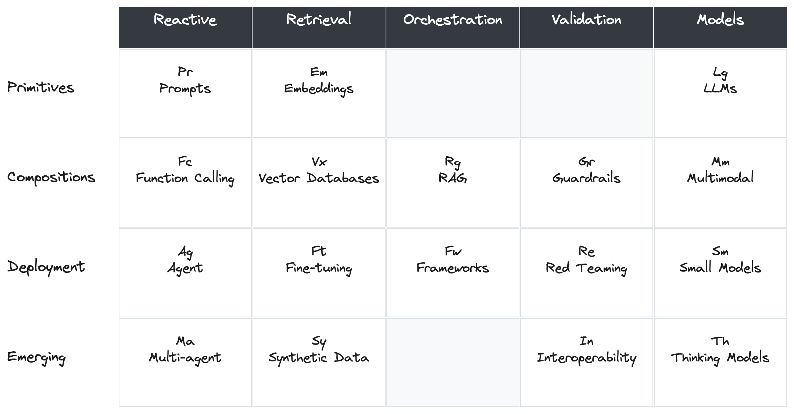

# The AI Periodic Table — Quick Reference
### Your Map of the AI Landscape

---

## The AI Periodic Table

## The 5 Elements Used Today

| Element | What It Is | Why It Matters | Your Lever |
|---|---|---|---|
| **Prompts (Pr)** | The instructions you give AI | Skills are packaged prompts. Better instructions = better output. | Rewrite your skill's instructions. Add examples. Be specific. |
| **RAG (Rg)** | Retrieval-Augmented Generation — how AI finds your documents | Why connectors exist. Why AI sometimes can't find your file. | Add metadata headers. Organize documents. Choose which sources to include. |
| **Context Windows** | How much AI can "see" at once (ChatGPT: 128K tokens, Claude: 200K) | Long documents get truncated. Large collections require retrieval. | Break long docs into focused pieces. Use NotebookLM for multi-doc synthesis. |
| **Agents (Ag)** | AI that takes action, not just responds | Skills with steps = agent workflows that run consistently | Define clear steps. Test with real data. Iterate. |
| **Guardrails (Gr)** | Quality control — where AI breaks | AI fabricates statistics. AI misses nuance. AI needs human review. | Always verify numbers. Use source-grounded tools (NotebookLM). Add review steps. |

---

## The Full Landscape (For Reference)

### Row 1: Primitives — The Building Blocks
- **Pr** Prompts — instructions and examples you give AI
- **Em** Embeddings — how AI turns text into searchable numbers
- **Lg** Large Language Models — the AI engine itself (GPT, Claude, Gemini)

### Row 2: Compositions — Combining Building Blocks
- **Rg** RAG — retrieve your documents, then generate answers
- **Vx** Vector Databases — where embeddings are stored for search
- **Fc** Function Calling — AI that can use tools (search, calculate, create)
- **Gr** Guardrails — safety, accuracy, and quality controls
- **Mm** Multi-modal — text + images + audio + video

### Row 3: Deployment — Production Systems
- **Ag** Agents — AI that plans and executes multi-step tasks
- **Fw** Frameworks — orchestration tools (workflows, automation)
- **Ft** Fine-Tuning — training AI on your specific data
- **Sm** Small Models — fast, cheap, good enough for simple tasks

### Row 4: Emerging — Cutting Edge
- **Ma** Multi-Agent — multiple AI agents working together
- **Th** Thinking Models — AI that reasons step-by-step before answering
- **Sy** Synthetic Data — AI-generated training data
- **In** Interpretability — understanding why AI makes decisions

---

## The Problem-Solving Framework

When you encounter an AI task, ask these five questions:

1. **What's the outcome?** — What does success look like? Skills automate processes, not just tasks.
2. **What data does it need?** — Upload, connector, or custom pipeline?
3. **How repeatable is it?** — One-off = prompt. Recurring = skill. Automated = agent.
4. **What could go wrong?** — Hallucination? Privacy? Quality?
5. **What levers can you tweak?** — Instructions, examples, model, sources, metadata

---

## Learn More

- **Video: IBM's AI Periodic Table Explained:** https://www.youtube.com/watch?v=ESBMgZHzfG0
- **Interactive Board:** https://miro.com/app/board/uXjVGR6Ig2I=/?share_link_id=193744778638

---

*Super Web Pros | superwebpros.com | Jesse Flores — jesse@superwebpros.com*
