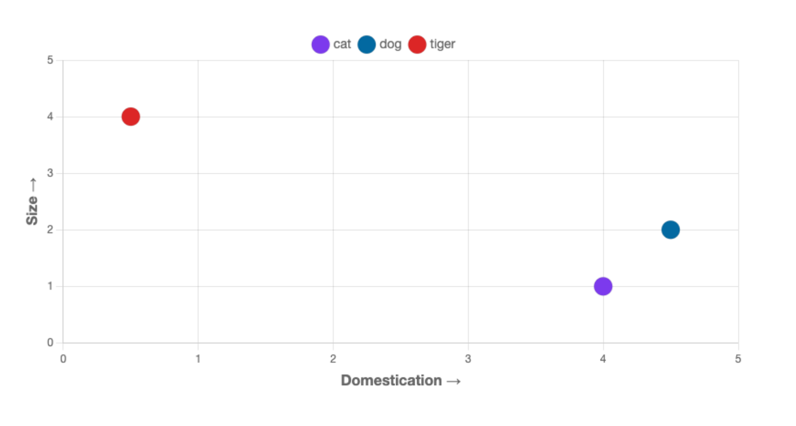
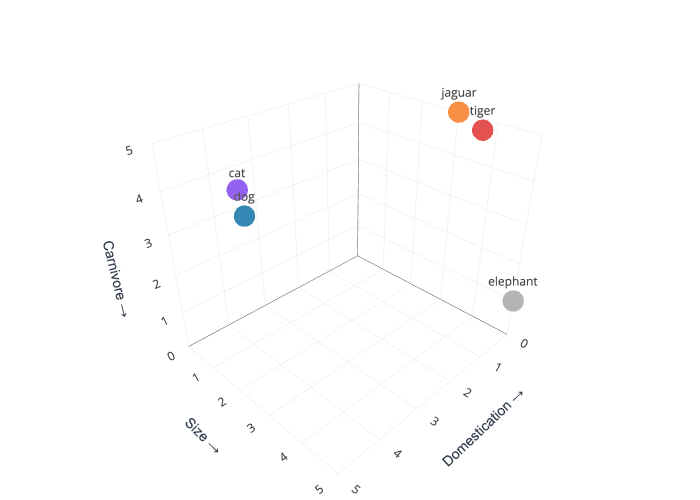
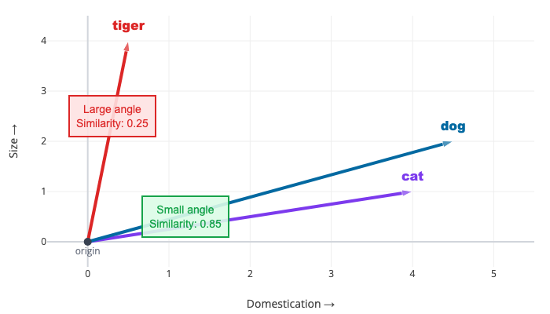

# RAG, Embeddings & Semantic Search — A Primer
### How AI finds and uses your documents

---

## The Problem RAG Solves

AI models are stateless — every conversation starts fresh. They don't remember previous sessions, and they don't have access to your documents unless you give them access.

Even when you do, there's a limit to how much they can "see" at once:

| Tool | Context Window | Roughly... |
|---|---|---|
| ChatGPT | 128K tokens | ~96K words |
| Claude | 200K tokens | ~150K words |

Your full document library won't fit. So the AI needs a way to find the *right* pieces of your knowledge for each question. That's RAG.

---

## RAG in Three Steps

**RAG = Retrieve → Augment → Generate**

1. **Retrieve:** Search your documents to find the relevant pieces
2. **Augment:** Add those pieces to the prompt as context
3. **Generate:** The AI responds using that specific context

### Without RAG:
> **You:** "What were the key policy changes last quarter?"
> **AI:** "I don't have specific information about your organization's policy tracking..."

### With RAG:
> **You:** "What were the key policy changes last quarter?"
> **AI:** "According to your Q1 2026 Market Update, the three key policy changes were: (1) Trump extended tariff rebates for domestic automakers through 2030... (2) A 25% tariff on heavy-duty trucks from Mexico took effect November 1... (3) The Diesel Truck Liberation Act was introduced in the Senate..."

The difference: specific, sourced, useful vs. generic and unhelpful.

---

## How It Works Under the Hood

### Step 1: Ingestion (one-time setup)

Your documents go through a preparation process:

```
Documents → Chunk → Embed → Store
```

- **Chunk:** Break documents into smaller pieces (~800 tokens each). This is necessary because the AI needs to find *specific relevant sections*, not entire 50-page reports.

- **Embed:** Convert each chunk into a numerical representation (a "vector") that captures its meaning. Think of it as plotting the meaning of each chunk in a multi-dimensional space.

- **Store:** Save these vectors in a searchable database.

### Step 2: Query (every time you ask a question)

```
Question → Embed → Search → Retrieve → Augment → Generate
```

- Your question gets converted into the same kind of vector
- The system finds chunks whose vectors are closest to your question's vector
- Those chunks get added to the prompt
- The AI generates a response grounded in your actual documents

---

## Embeddings: How AI Understands Meaning

An embedding is a list of numbers that represents the *meaning* of a piece of text — not just the words, but the concepts.

### Why This Matters

Traditional search (keyword matching) finds "tariff" only in documents that contain the word "tariff." 

Semantic search (embedding-based) finds documents about tariffs even if they use words like "import duties," "trade barriers," or "customs levies" — because the *meaning* is similar even when the *words* are different.

### A Simple Analogy

Imagine plotting text on a 2D chart — two dimensions that capture some aspect of meaning:



With just two axes, similar concepts already cluster together. Now add a third dimension:



More dimensions = more nuance. The AI can separate concepts that looked similar in 2D. Real embeddings do this in 1,500+ dimensions — capturing meaning along axes like topic, tone, specificity, domain, and hundreds more that don't have human names.

### How Semantic Search Uses This

When you ask a question, the AI converts it into a vector in the same space, then finds the closest document chunks — even if they use completely different words:



This is why searching for "import duties" can find a document that only mentions "tariffs" — the vectors are close because the *meaning* is close.

---

## Chunking: Why It Matters

When your documents get broken into chunks, the quality of that chunking directly affects retrieval quality.

### How Built-In Connectors Chunk

ChatGPT Enterprise and similar tools use **fixed-size chunking**: every ~800 tokens, they cut. This is simple and fast, but it has real limitations:

| Works Well For | Breaks Down For |
|---|---|
| Plain text paragraphs | Tables and structured data |
| Simple prose | Reports with section headers |
| Short documents | Cross-referencing between sections |
| General Q&A | Precise data lookups |

### What This Means for You

If you ask "What was the GDP projection?" and the relevant sentence got split across two chunks, the AI might not find it. Or it might find half the context and give an incomplete answer.

**This is why "the AI couldn't find my document" happens.** It's not that the document isn't connected — it's that the relevant information got split, or the semantic match wasn't strong enough.

---

## What You Can Control (Without Building Pipelines)

You can't change how ChatGPT or Claude chunk your documents. But you CAN make your documents easier for any AI to find and understand:

### 1. Add Metadata Headers

At the top of every document:

```
---
Document Type: Market Update
Topic: Tariffs, Trade Policy, Aftermarket
Region: North America
Period: Q1 2026
Keywords: EV incentives, USMCA, supply chain
Summary: Quarterly update on trade policy developments 
  affecting automotive aftermarket suppliers.
---
```

Every AI tool indexes full text. This header becomes searchable context that helps retrieval — even when the connector doesn't support metadata filtering natively.

### 2. Use Clear Headings and Structure

AI chunking breaks more reliably on headings than on arbitrary character counts. Clear document structure = cleaner chunks = better retrieval.

### 3. Keep Documents Focused

A 5-page focused brief on tariff policy retrieves better than a 100-page omnibus report where tariff policy is on page 47. If a document covers multiple topics, consider splitting it.

### 4. Don't Bury Key Data in Images or Complex Tables

Most AI connectors extract text only. If critical data lives in a chart, add a text summary nearby. If a table contains key figures, include a prose summary of the key takeaways.

### 5. Add Summaries at the Top

Start every document with a 2-3 sentence summary. This gives the AI (and humans) a quick way to assess relevance.

### 6. Use Lowercase, Hyphenated File Names

Name files like `q1-2026-market-update.pdf`, not `Q1 2026 Market Update.pdf`. Spaces in file names cause problems across different operating systems, web servers, and AI pipelines. Lowercase with hyphens is universally safe and easier for both humans and machines to work with.

---

## RAG Across Different Tools

| Tool | How It Does RAG | What You Control |
|---|---|---|
| **ChatGPT Enterprise** (SharePoint/Drive connector) | Pre-indexes your docs automatically. ~800 token chunks, semantic search. | Which sites/folders to sync. Document quality and structure. |
| **Claude** (Google Drive connector) | Loads documents on-demand into context window. No pre-indexing. | Which docs to reference. Works best with focused requests. |
| **NotebookLM** | You upload specific sources. RAG is scoped to exactly those sources. | Which sources to include. Best for source-grounded accuracy. |
| **Custom GPTs / Skills** | Upload files directly. OpenAI handles chunking and retrieval. | Which files to include. Quality of uploaded content. |
| **Custom Pipeline** (Qdrant, Pinecone, etc.) | Full control: chunking strategy, embedding model, retrieval tuning, metadata filtering. | Everything — but requires engineering. |

### The Tradeoff

**Built-in connectors:** Zero setup, good enough for general Q&A, but no control over chunking or retrieval quality.

**Custom pipelines:** Full control, metadata filtering, structured chunking — but requires engineering investment.

**For most teams starting out:** Built-in connectors + good document discipline gets you 80% of the value. If you later need precision retrieval (e.g., member-facing tools), that's when custom pipelines matter.

---

## Key Concepts to Remember

1. **RAG = Retrieve → Augment → Generate** — AI searches your docs, adds context to the prompt, generates a grounded response

2. **Embeddings capture meaning, not just words** — Semantic search finds relevant content even when exact keywords don't match

3. **Chunking quality = retrieval quality** — How documents are split directly affects what the AI can find

4. **Context window = how much AI can "see" at once** — Bigger isn't always better; retrieval selects the right pieces

5. **Document discipline is the cheapest RAG improvement** — Metadata headers, clear structure, and focused documents help every AI tool

6. **Generic AI is a commodity; connected AI is differentiation** — The value is in YOUR knowledge base, not the model itself

---

## Resources

- **IBM AI Periodic Table video:** https://www.youtube.com/watch?v=ESBMgZHzfG0
- **NotebookLM (free, source-grounded RAG):** notebooklm.google.com
- **OpenAI embeddings docs:** platform.openai.com/docs/guides/embeddings
- **Anthropic context windows:** docs.anthropic.com

---

*Super Web Pros | superwebpros.com | Jesse Flores — jesse@superwebpros.com*
